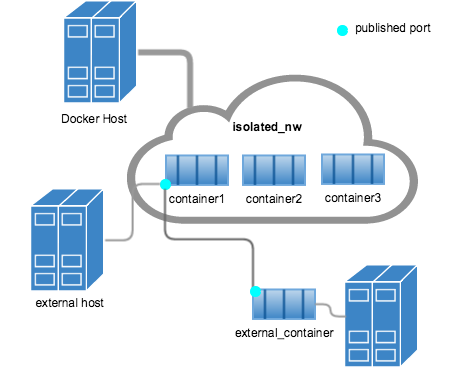

###############################################################################
Docker CE
###############################################################################
https://docs.docker.com/

- `Command line overview`_
- `Create images`_
- `Run container`_
- `Container data mounts`_
- `Container networking`_
- `Docker Hub`_
- `Install Docker`_
- `Configuration files`_
- `Hints`_

===============================================================================
Command line overview
===============================================================================

- Docker run reference:
  https://docs.docker.com/engine/reference/run/
- Use the Docker command line:
  https://docs.docker.com/engine/reference/commandline/cli/

To get help on all available commands::

    $ docker help
    $ docker [COMMAND] [SUBCOMMAND] --help

To detaching from the container without stopping: <ctrl-p,q>

docker build [OPTIONS] PATH | URL | -
-------------------------------------
https://docs.docker.com/engine/reference/commandline/build/

Build an image from a Dockerfile.

-t, --tag list      Name and optionally a tag in the 'name:tag' format.
--network string    Set the networking mode for the RUN instructions during build.
-f, --file string   Name of the Dockerfile (Default is 'PATH/Dockerfile').
-q, --quiet         Suppress the build output and print image ID on success.
--pull              Always attempt to pull a newer version of the image.
--force-rm          Always remove intermediate containers.

.. code-block:: bash

    $ docker build -t <image-name> .
    $ docker build -t <hub>/<repo>:<tag> .
    $ docker build -t <image-name> https://github.com/user/repo.git#branch:folder
    $ docker build http://server/context.tar.gz
    $ docker build - < Dockerfile

docker create [OPTIONS] IMAGE [COMMAND] [ARG...]
------------------------------------------------
https://docs.docker.com/engine/reference/commandline/create/

Creates a writeable container layer over the specified image and prepares
it for running the specified command. This is similar to ``docker run -d``
except the container is never started.

--name		        Assign a name to the container.
-i, --interactive   Keep STDIN open even if not attached.
-t, --tty           Allocate a pseudo-TTY.
--network string    Connect a container to a network.
--restart string    Restart policy to apply when a container exits
                    (default "no").
--pid string
    Set the PID Namespace mode for the container.
    ``container:<name|id>`` - joins another container's PID namespace.
    ``host`` - use the host's PID namespace inside the container.

.. code-block:: bash

    $ docker create -ti fedora bash

docker start [OPTIONS] CONTAINER [CONTAINER...]
-----------------------------------------------
https://docs.docker.com/engine/reference/commandline/start/

Start one or more stopped containers

--attach, -a		Attach STDOUT/STDERR and forward signals.
--interactive, -i	Attach container’s STDIN.

docker stop [OPTIONS] CONTAINER [CONTAINER...]
----------------------------------------------
The main process inside the container will receive SIGTERM, and after a
grace period, SIGKILL.

--time, -t 10	    Seconds to wait for stop before killing it.

docker run [OPTIONS] IMAGE [COMMAND] [ARG...]
---------------------------------------------
https://docs.docker.com/engine/reference/commandline/run/

Сreates a writeable container layer over the specified image, and then
starts it using the specified command. It is equivalent to the API
``create`` then ``start``.

--name		        Assign a name to the container.
--detach, -d        Run container in background and print container ID.
--interactive, -i   Keep STDIN open even if not attached.
--tty, -t           Allocate a pseudo-TTY.
--attach, -a        Attach to STDIN, STDOUT or STDERR.
--network string    Connect a container to a network.
--publish, -p       Publish a container’s port(s) to the host.
--publish-all, -P   Publish all exposed ports to random ports.
--restart string    Restart policy to apply when a container exits
                    (default "no").
--rm                Automatically remove the container when it exits.
--pid string
    Set the PID Namespace mode for the container.
    ``container:<name|id>`` - joins another container's PID namespace.
    ``host`` - use the host's PID namespace inside the container.

.. code-block:: bash

    # NOTE: To not expose cointainer to outside world map to host's 127.0.0.1
    # Detached, map container's 5555 to host's 5000 port
    $ docker run -d -p 127.0.0.1:5000:5555 --name some_cont some_img
    # Interactive, autoremove container after exit
    $ docker run -it --rm -p 127.0.0.1:5000:5555 --name some_cont some_img

docker exec [OPTIONS] CONTAINER COMMAND [ARG...]
------------------------------------------------
https://docs.docker.com/engine/reference/commandline/exec/

Run a new command in a running container.

.. code-block:: bash

    $ docker exec -it alpine_cont /bin/sh

docker attach [OPTIONS] CONTAINER
---------------------------------
https://docs.docker.com/engine/reference/commandline/attach/

Attach local standard input, output, and error streams to a running
container.  The attach command will display the output of the
ENTRYPOINT/CMD process. This can appear as if the attach command is hung
when in fact the process may simply not be interacting with the terminal at
that time.

--no-stdin  		Do not attach STDIN.

docker images [OPTIONS] [REPOSITORY[:TAG]]
------------------------------------------
https://docs.docker.com/engine/reference/commandline/images/

Show all top level images, their repository and tags, and their size.

--all, -a           Show all images (default hides intermediate images).
--digests           Show digests.
--filter, -f        Filter output based on conditions provided.
--no-trunc          Don’t truncate output.
--quiet, -q         Only show numeric IDs.

docker ps [OPTIONS]
-------------------
https://docs.docker.com/engine/reference/commandline/ps/

List containers.

--all, -a           Show all containers (default shows just running).
--latest, -l        Show the latest created container (includes all states).
--quiet, -q         Only display numeric IDs.
--filter, -f        Filter output based on conditions provided.
--no-trunc          Don’t truncate output.
--size, -s          Display total file sizes.

docker logs [OPTIONS] CONTAINER
-------------------------------
https://docs.docker.com/engine/reference/commandline/logs/

Fetch the logs of a container.

--details		    Show extra details provided to logs.
--follow, -f        Follow log output.
--since		        Show logs since timestamp (e.g. 2013-01-02T13:23:37)
                    or relative (e.g. 42m for 42 minutes).
--tail all	        Number of lines to show from the end of the logs.
--timestamps, -t    Show timestamps.

docker top CONTAINER [ps OPTIONS]
---------------------------------
Display the running processes of a container.

docker rm [OPTIONS] CONTAINER [CONTAINER...]
--------------------------------------------
https://docs.docker.com/engine/reference/commandline/rm/

Remove one or more containers.

--force, -f         Force the removal of a running container (uses SIGKILL).

.. code-block:: bash

    # Remove a container and its volumes:
    $ sudo docker rm -v redis
    # Remove all containers, produce error for running containers:
    $ sudo docker rm $(sudo docker ps -aq)
    # Remove all non-running containers:
    $ sudo docker rm $(sudo docker ps -aq -f status=exited)

docker rmi [OPTIONS] IMAGE [IMAGE...]
-------------------------------------
https://docs.docker.com/engine/reference/commandline/rmi/

Remove one or more images, using short or long ID, tag or digest.

--force, -f	        Force removal of the image
--no-prune	        Do not delete untagged parents

.. code-block:: bash

    # Delete all images:
    $ sudo docker rmi $(sudo docker images -q)
    # Delete all images forced:
    $ sudo docker rmi -f $(sudo docker images -q)

Some other commands
-------------------

docker network COMMAND
    Manage networks.

    =========================== ===============================================
    docker network connect      Connect a container to a network.
    docker network create       Create a network.
    docker network disconnect   Disconnect a container from a network.
    docker network inspect      Display detailed information on networks.
    docker network ls           List networks.
    docker network prune        Remove all unused networks.
    docker network rm           Remove one or more networks.
    =========================== ===============================================

docker system df [OPTIONS]
    Show docker disk usage.

    --verbose, -v       Show detailed information on space usage.

docker system prune [OPTIONS]
    Remove all unused containers, volumes, networks and images (both dangling
    and unreferenced).

    --all, -a           Remove all unused images not just dangling ones.
    --force, -f         Do not prompt for confirmation.

docker stats [OPTIONS] [CONTAINER...]
    https://docs.docker.com/engine/reference/commandline/stats/

    Display a live stream of container(s) resource usage statistics.

    --no-stream		    Disable streaming stats and only pull the first result

docker history [OPTIONS] IMAGE
    https://docs.docker.com/engine/reference/commandline/history/

    Show the history of an image.

docker info [OPTIONS]
    Displays system wide information regarding the Docker installation.

docker inspect [OPTIONS] NAME|ID [NAME|ID...]
    Return low-level information on Docker objects

===============================================================================
Create images
===============================================================================

You can start Dockerfiles from a **parent image** or create a **base image**
instead:

- A **parent image** is the image that your image is based on. It refers to the
  contents of the ``FROM`` directive in the Dockerfile. Each subsequent
  declaration in the Dockerfile modifies this parent image.

- A **base image** either has no ``FROM`` line in its Dockerfile,
  or has ``FROM scratch``.
  Read more at: https://docs.docker.com/engine/userguide/eng-image/baseimages/

Build new image from ``Dockerfile`` in current dir::

    $ sudo docker build -t <image-name> .

Add a tag to an existing image after build::

    $ sudo docker tag <image-name-or-id> <hub-user>/<image-name>:<tag>

Git repositories
----------------
https://docs.docker.com/engine/reference/commandline/build/#git-repositories

When the URL parameter points to the location of a Git repository, the
repository acts as the build context. The system recursively fetches the
repository and its submodules. The commit history is not preserved.

A repository is first pulled into a temporary directory on your local host.
After that succeeds, the directory is sent to the Docker daemon as the context.
Local copy gives you the ability to access private repositories using local
user credentials, VPN’s, and so forth.

::

    $ docker build -t <image-name> https://github.com/user/repo.git#branch:folder

Multi-stage builds
------------------

- https://docs.docker.com/engine/userguide/eng-image/multistage-build/
- https://blog.alexellis.io/mutli-stage-docker-builds/

With multi-stage builds, you use multiple ``FROM`` statements in your
Dockerfile. Each ``FROM`` instruction can use a different base, and each of
them begins a new stage of the build. You can selectively copy artifacts from
one stage to another, leaving behind everything you don’t want in the final
image.

===============================================================================
Run container
===============================================================================
https://docs.docker.com/engine/reference/run/

The ``docker run`` command must specify an IMAGE to derive the container from.

Detached (-d)
-------------

By design, containers started in detached mode exit when the root process used
to run the container exits.

Do not pass a ``service nginx start`` command to a detached container. This
succeeds in starting the ``nginx`` service inside the container. However, the
root process (``service nginx start``) returns and the detached container stops
as designed. As a result, the ``nginx`` service is started but could not be
used. Instead, to start a process such as the ``nginx`` web server do the
following::

    $ docker run -d -p 80:80 my_image nginx -g 'daemon off;'

To do input/output with a detached container use network connections or shared
volumes. These are required because the container is no longer listening to the
command line where docker run was run.

To reattach to a detached container, use ``docker attach`` command.

Foreground
----------

In foreground mode, ``docker run`` can start the process in the container and
attach the console to the process’s standard input, output, and standard error.
It can even pretend to be a TTY and pass along signals.

If you do not specify ``-a`` then Docker will attach to both STDOUT/STDERR.

For interactive processes (like a shell), you must use ``-it`` together in
order to allocate a tty for the container process.

.. note:: A process running as PID 1 inside a container is treated specially by
    Linux: it ignores any signal with the default action. So, the process will
    not terminate on SIGINT or SIGTERM unless it is coded to do so.

Example: run htop inside a container
------------------------------------

Create this Dockerfile:

.. code-block:: dockerfile

    FROM alpine:latest
    RUN apk add --no-cache htop
    CMD ["htop"]

Build and tag the image::

    $ docker build -t myhtop .

Run htop inside a container::

    $ docker run -it --rm --pid=host myhtop

``--pid=host`` - share the host’s process namespace with container, that's
allow processes within the container to see all of the processes on the host
system.

Restart policies (–restart)
---------------------------
https://docs.docker.com/engine/reference/run/#restart-policies-restart

``no``
    Do not automatically restart the container when it exits. This is the
    default.

``on-failure[:max-retries]``
    Restart only if the container exits with a non-zero exit status.
    Optionally, limit the number of restart retries the Docker daemon attempts.

``always``
    Always restart the container regardless of the exit status. When you
    specify always, the Docker daemon will try to restart the container
    indefinitely. The container will also always start on daemon startup,
    regardless of the current state of the container.

``unless-stopped``
    Always restart the container regardless of the exit status, but do not
    start it on daemon startup if the container has been put to a stopped state
    before.

===============================================================================
Container data mounts
===============================================================================
https://docs.docker.com/engine/admin/volumes/

Docker offers three different ways to mount data into a container from the
Docker host:

- **Volumes** are stored in a part of the host filesystem which is managed by
  Docker (/var/lib/docker/volumes/ on Linux). Non-Docker processes should not
  modify this part of the filesystem. Volumes are the best way to persist data
  in Docker.

- **Bind mounts** may be stored anywhere on the host system. They may even be
  important system files or directories. Non-Docker processes on the Docker
  host or a Docker container can modify them at any time.

- **tmpfs mounts** are stored in the host system’s memory only, and are never
  written to the host system’s filesystem.

No matter which type of mount you choose to use, the data looks the same from
within the container. It is exposed as either a directory or an individual file
in the container’s filesystem.

.. note:: For Docker 17.06+ use ``--mount`` flag for both containers and
          services, for bind mounts, volumes, or tmpfs mounts, as the syntax
          is more clear than ``--volume``.

If you use either bind mounts or volumes, keep the following in mind:

- If you mount an empty volume into a directory in the container in which files
  or directories exist, these files or directories will be propagated (copied)
  into the volume. Similarly, if you start a container and specify a volume
  which does not already exist, an empty volume is created for you. This is a
  good way to pre-populate data that another container needs.

- If you mount a bind mount or non-empty volume into a directory in the
  container in which some files or directories exist, these files or
  directories are obscured by the mount.

Bind mounts
-----------
https://docs.docker.com/engine/admin/volumes/bind-mounts/

When you use a bind mount, a file or directory on the host machine is mounted
into a container. The file or directory is referenced by its full or relative
path on the host machine.

You can’t use Docker CLI commands to directly manage bind mounts.

If you use ``--mount`` to bind-mount a file or directory that does not yet
exist on the Docker host, Docker does **not** automatically create it for you,
but generates an error.

Start a container with a bind mount::

    $ docker run -d -it --name devtest \
      --mount type=bind,source="$(pwd)"/app,target=/app \
      nginx:latest

and verify "Mounts" section::

    $ docker inspect devtest

Use a read-only bind mount::

    $ docker run -d -it --name devtest \
      --mount type=bind,source="$(pwd)"/app,target=/app,readonly \
      nginx:latest

tmpfs mounts
------------
https://docs.docker.com/engine/admin/volumes/tmpfs/

volumes
-------
https://docs.docker.com/engine/admin/volumes/volumes/

===============================================================================
Container networking
===============================================================================
https://docs.docker.com/engine/userguide/networking/

After install Docker creates three networks automatically::

    $ docker network ls

    NETWORK ID          NAME                DRIVER
    7fca4eb8c647        bridge              bridge
    9f904ee27bf5        none                null
    cf03ee007fb4        host                host

These three networks are built into Docker. When you run a container, you can
use the ``--network`` flag to specify which networks your container should
connect to.

- The **bridge** network represents the ``docker0`` network present in all
  Docker installations. Unless you specify otherwise with the ``docker run
  --network=<NETWORK>`` option, the Docker daemon connects containers to this
  network **by default**.

- The **none** network adds a container to a container-specific network stack.
  That container lacks a network interface. Use it to disable all incoming and
  outgoing networking::

    $ docker run -ti --network=none --name=container1 busybox

- The **host** network adds a container on the host’s network stack. As far as
  the network is concerned, there is no isolation between the host machine and
  the container. If you run a container that runs a web server on port 80 using
  "host" networking, the web server is available on port 80 of the host machine.

The **none** and **host** networks are not directly configurable in Docker.
However, you can configure the default **bridge** network, as well as your own
**user-defined bridge** networks.

The default bridge network
--------------------------

The default bridge network is present on all Docker hosts. If you do not
specify a different network, new containers are automatically connected to the
default bridge network.

For example, run two "busybox" containers, which are each connected to the
default bridge network::

    $ docker run -itd --name=container1 busybox
    $ docker run -itd --name=container2 busybox

Inspect the bridge network - both containers are connected to the network::

    $ docker network inspect bridge

Containers connected to the default bridge network can communicate with each
other by IP address.

.. note:: Docker does not support automatic service discovery on the default
    bridge network. If you want containers to be able to resolve IP addresses
    by container name, you should use **user-defined** networks instead.

You can attach to a running container and test the network connection to the IP
address of the other container::

    $ docker attach container1
    root@3386a527aa08:/# ping -w3 172.17.0.3

To **disable default bridge network** (will not be created at all), add the
following to the ``daemon.json`` file and restart Docker::

    "bridge": "none",
    "iptables": "false"

User-defined networks
---------------------

Use user-defined bridge networks to control which containers can communicate
with each other, and also to enable automatic DNS resolution of container names
to IP addresses.

Docker provides default network drivers for creating these networks. You can
create a new bridge network, overlay network or MACVLAN network. You can also
create a network plugin or remote network for complete customization and
control.

A bridge network resides on a single host running an instance of Docker Engine.
An overlay network can span multiple hosts running their own engines.

A bridge network is the most common type of network used in Docker. To create
bridge network::

    $ docker network create --driver bridge isolated_nw
    # "--driver bridge" is default, so can be omitted
    $ docker network inspect isolated_nw
    $ docker network ls

Launch container on this network::

    $ docker run --network=isolated_nw -itd --name=container3 busybox

Each container in the network can immediately communicate with other containers
in the network. Though, the network itself isolates the containers from
external networks.

Within a user-defined bridge network, linking is not supported. You can expose
and publish container ports on containers in this network. This is useful if
you want to make a portion of the bridge network available to an outside
network.

Exposing and publishing ports
-----------------------------

In Docker networking, there are two different mechanisms that directly involve
network ports: **exposing** and **publishing** ports. This applies to the
default bridge network and user-defined bridge networks.

You **expose** ports using the ``EXPOSE`` keyword in the Dockerfile or the
``--expose`` flag to ``docker run``. Exposing ports is a way of documenting
which ports are used, but **does not actually map or open any ports**. Exposing
ports is optional.

You **publish** ports using the ``--publish`` or ``--publish-all`` flag to
``docker run``. This tells Docker which ports to open on the container’s
network interface. When a port is published, it is mapped to an available
high-order port (higher than 30000) on the host machine, unless you specify the
port to map to on the host machine at runtime. You cannot specify the port to
map to on the host machine when you build the image (in the Dockerfile),
because there is no way to guarantee that the port will be available on the
host machine where you run the image.

Docker and iptables
-------------------

Docker modifies iptables rules when you start or stop containers which publish
ports, when you create or modify networks or attach containers to them, or for
other network-related operations.

Docker dynamically manages iptables rules for the daemon, as well as your
containers, services, and networks. In Docker 17.06 and higher, you can add
rules to a new table called DOCKER-USER, and these rules will be loaded before
any rules Docker creates automatically. This can be useful if you need to
pre-populate iptables rules that need to be in place before Docker runs.

===============================================================================
Docker Hub
===============================================================================

- Docker Hub Docs: https://docs.docker.com/docker-hub/
- Explore Official Repositories: https://hub.docker.com/explore/

You can configure Docker Hub repositories in two ways:

- **Repositories**, which allow you to push images from a local Docker daemon
  to Hub.
- **Automated Builds**, which link to a source code repository and trigger an
  image rebuild process on Hub when changes are detected in the source code.

Docker itself provides access to Docker Hub services via commands:

- ``docker search``
- ``docker login``
- ``docker logout``
- ``docker pull``
- ``docker push``

The repository name must be unique within Docker ID namespace, can be 2 to 255
characters, and can only contain lowercase letters, numbers or ``-`` and ``_``.

Push repository to Hub
----------------------

To push a repository to the Hub, you need to name your local image
by build it::

    sudo docker build -t <hub-user>/<repo-name>[:<tag>]

or by re-tagging an existing local image (by image name or ID)::

    sudo docker tag <existing-image-name-or-id> <hub-user>/<repo-name>[:<tag>]

or by to commit changes::

    sudo docker commit <exiting-container> <hub-user>/<repo-name>[:<tag>]

To log into the Hub from the command line::

    sudo docker login --username=<hub-user>

Now you can push this repository to the registry::

    sudo docker push <hub-user>/<repo-name>:<tag>

Webhooks
--------
https://docs.docker.com/docker-hub/repos/#webhooks

A webhook is an HTTP call-back triggered by a specific event. You can use a Hub
repository webhook to notify people, services, and other applications after a
new image is pushed to your repository. For example, you can trigger an
automated test or deployment to happen as soon as the image is available.

A webhook is called only after a successful push is made. The webhook calls are
HTTP POST requests with a JSON payload similar to the example shown below.

Automated builds
----------------
https://docs.docker.com/docker-hub/builds/

===============================================================================
Install Docker
===============================================================================

- Install Docker CE on Ubuntu:
  https://docs.docker.com/engine/installation/linux/docker-ce/ubuntu/#install-docker-ce

- Release notes:
  https://docs.docker.com/release-notes/docker-ce/

- Stable releases .deb packages:
  https://download.docker.com/linux/ubuntu/dists/xenial/pool/stable/amd64/

Download ``.deb`` package::

    $ wget -O /tmp/docker.deb https://download.docker.com/linux/ubuntu/dists/xenial/pool/stable/amd64/docker-ce_17.09.0~ce-0~ubuntu_amd64.deb

Install package::

    $ sudo apt install /tmp/docker.deb

    # or alternative method:
    #   sudo dpkg --install /tmp/docker.deb
    #   sudo apt-get install -f

The Docker daemon starts automatically.

Verify that Docker is installed correctly - download and run a test image, it
prints an informational message and exits::

    $ sudo docker run hello-world

To manual start/stop daemon::

    $ service docker status
    $ sudo service docker stop
    $ sudo service docker start

To enable/disable autostart on boot for **systemd**::

    $ sudo systemctl enable docker
    $ sudo systemctl disable docker

To uninstall::

    $ sudo apt purge docker-ce

    # or alternative method:
    #   sudo dpkg --purge docker-ce

and delete all images, containers, and volumes::

    $ sudo rm -rf /var/lib/docker

To manage Docker as a non-root user
(https://docs.docker.com/engine/installation/linux/linux-postinstall/)::

    # Create the docker group.
    $ sudo groupadd docker

    # Add your user to docker group.
    $ sudo usermod -aG docker <user_name>

    # Log out and log back in.

===============================================================================
Configuration files
===============================================================================
https://docs.docker.com/engine/reference/commandline/cli/#configuration-files

By default, the Docker command line stores its configuration in a
``$HOME/.docker`` directory.

You can modify the ``config.json`` file to control certain aspects of how the
docker command behaves. For example, customize detach key sequence:

.. code-block:: json

    {
        "detachKeys": "ctrl-e,e",
    }

===============================================================================
Hints
===============================================================================

Docker save an image or docker export a container. This will output a tar file
to standard output, so you will like to do something like::

    docker save 'dockerizeit/agent' > dk.agent.lastest.tar

Then you can use ``docker load`` or ``docker import`` in a different host.

Some examples
-------------

.. code-bash:: bash

    # Run shell in alpine container
    $ sudo docker run -it --rm alpine /bin/sh

Some old samples
----------------

.. code-block:: bash

    sudo docker run -ti -v /var/www/docks:/var/www/docks \
                        -v /var/www/d_logs:/home/logs \
                        -v /var/www/docks/ssmtp/ssmtp.conf:/etc/ssmtp/ssmtp.conf \
                        -p 127.0.0.1:9000:9000 \
                        --name php itnow/php5-fpm bash

    # On first run for setup add
    #    -e MYSQL_ROOT_PASSWORD=<some_root_pass>
    # Add /my/custom/mysql.cnf with
    #    -v /my/custom:/etc/mysql/conf.d
    # for overwrite setting without rebuild image
    sudo docker run -ti -v /var/www/d_mysql_dbs:/var/lib/mysql \
                        -v /var/www/d_mysql_dumps:/home/dumps \
                        -v /var/www/d_logs:/home/logs \
                        -e MYSQL_ROOT_PASSWORD=hard_to_pass \
                        -p 127.0.0.1:3306:3306 \
                        --name mysql itnow/mysql

    sudo docker exec some-mysql sh -c 'exec mysqldump --all-databases -uroot -p"$MYSQL_ROOT_PASSWORD"' > /some/path/at/host/all-databases.sql

    # Step in running container
    sudo docker exec -ti mysql bash

    docker run -d -v /var/www/d_mongo/db:/data/db \
                  -v /var/www/d_logs:/var/log/mongodb \
                  -p 127.0.0.1:27017:27017 \
                  --name mongo itnow/mongo
