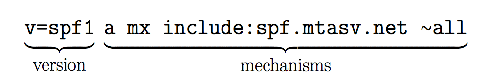
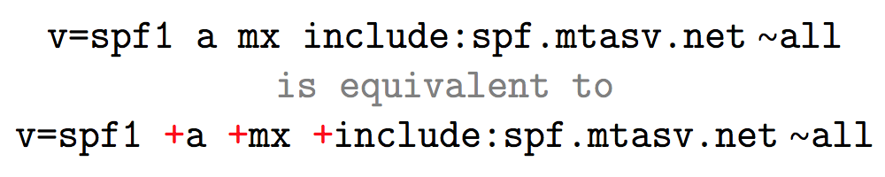
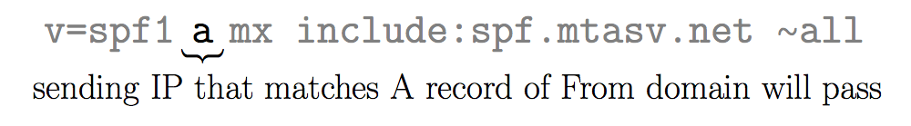
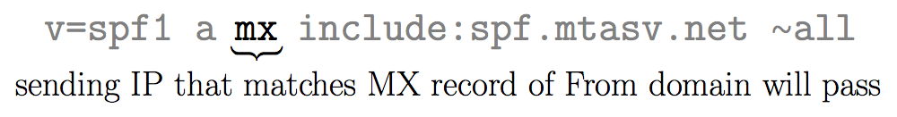
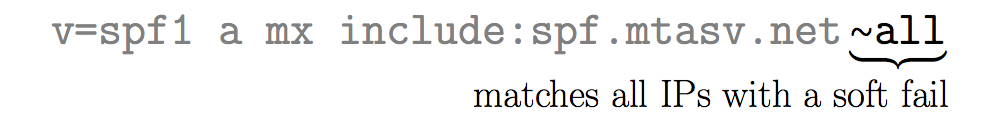

###############################################################################
Mail stuff
###############################################################################

SMTP
===============================================================================

- Specify correct encoding in Content-Type headers for all text parts of the
  email. Make sure that the real text encoding matches that specified in the
  header. Currently UTF-8 is the recommended and the most common text encoding.

- Create the headers `From:`, `Message-ID:` and `Date:` directly in the script
  for email sending. Make sure that these headers, especially `Date:`, are
  generated in the correct format. According to the standards these headers are
  generated together with the email text. If they are absent or formatted
  incorrectly, headers may be added by one of the transit servers, which can
  ruin the integrity of the DKIM-signature.

- Make sure that in all service or other headers, including `Subject`, names of
  files attached (`Content-Type` and `Content-Disposition`), characters
  different from ASCII, particularly Cyrillic, are encoded in
  `quoted-printable` or `base64`. According to the standards, email headers
  cannot contain non-encoded 8-bit characters.

- The email string should not contain more than 998 8-bit characters. If you
  are using `UTF-8`, one displayed character can be represented by several
  octet bytes, so try to make the string text shorter or encode the text in
  `base64`.

- The correct string terminator in email is `CRLF` (characters with codes 13
  and 10). The standard string terminator for Unix is `LF`. If the script or
  MTA does not replace string terminators, the email may be displayed
  incorrectly, or part of the email may be cut. Errors may also be caused by
  duplicate terminator replacement.

- String terminators should not separate `UTF-8` characters; this will help avoid
  a situation in which the terminator is added to a long string between two
  octets of a Cyrillic character. For this reason, the text should be laid out
  before creating an email.

- Encoding text parts in `base64` makes an email larger by a third, but it helps
  to avoid problems related to string terminators in text parts.

PTR
===============================================================================

PTR records are used for the Reverse DNS (rDNS) lookup. Using the IP address
you can get the associated domain/hostname. An "A" record should exist for
every PTR record.

PTR records provides trust that the given hostname or a domain are connected to
the IP address. The PTR records are must have for outgoing mail servers,
because most of the mail providers reject or mark as spam messages received by
mail servers without valid rDNS configuration.

Check PTR records for the IP::
    
    $ dig -x 123.45.67.89

SPF
===============================================================================
- http://www.openspf.org/FAQ/Common_mistakes
- http://www.openspf.org/SPF_Record_Syntax
- https://postmarkapp.com/blog/explaining-spf

Example records::
    
    mx.example.com.  IN  TXT  "v=spf1 a mx ~all"
    mx.example.com.  IN  TXT  "v=spf1 a mx ip4:123.4.5.67 ~all"

Publish SPF records for HELO names used by your mail servers::

    example.com.             IN  TXT  "v=spf1 mx -all"
    mailserver.example.com.  IN  TXT  "v=spf1 a -all"

Publish null SPF records for your domains that don't send mail::

    example.com.       IN  TXT  "v=spf1 a:mail.example.com -all"
    mail.example.com.  IN  TXT  "v=spf1 a -all"
    www.example.com.   IN  TXT  "v=spf1 -all"

Check SPF record::
    
    $ dig +short txt example.org

Web tool:

    http://www.kitterman.com/spf/validate.html

spfquery tool::
    
    $ apt install spfquery
    $ spfquery -sender=user@example.org -ip=123.45.65.78 -helo=mx.example.org

DKIM
===============================================================================
- https://en.wikipedia.org/wiki/DomainKeys_Identified_Mail
- http://dkim.org/

DMARC
===============================================================================
- https://dmarc.org/overview/
- https://tools.ietf.org/html/rfc7489
- https://blog.returnpath.com/demystifying-the-dmarc-record/

Get DMARC record for domain::

    $ dig +short txt _dmarc.example.org

Example records::

    _dmarc IN TXT "v=DMARC1; p=none"

    _dmarc IN TXT "v=DMARC1; p=quarantine; aspf=r; fo=s;
                   ruf=mailto:postmaster@example.org;"

    _dmarc IN TXT "v=DMARC1; p=none; aspf=r; fo=s;
                   rua=mailto:postmaster@example.org;
                   ruf=mailto:postmaster@example.org;"

======= =================================== ===================================
v       Protocol version.                   v=DMARC1
p       Policy for organizational domain    p=quarantine
        (none / quarantine / reject).
sp      Policy for subdomains of the OD,    sp=reject
        by default same as "p".
adkim   Alignment mode for DKIM             adkim=s
        (s=strict, r=relaxed).
aspf    Alignment mode for SPF              aspf=r
        (s=strict, r=relaxed).
pct     Percentage of messages subjected    pct=20
        to filtering.
rua     Reporting URI of aggregate reports  rua=mailto:aggr_report@example.com
        (daily overall reports).
ruf     Reporting URI for forensic reports  ruf=mailto:auth_fail@example.com
        (send on auth failures).
fo      Requested options for generation    fo=s
        of failure reports.
        "0" - report if all auth
        mechanisms failed,
        "1" - if any failed.
        "d" - if DKIM failed.
        "s" - if SPF failed.
rf      Forensic reporting format(s).
ri      Aggregate Reporting interval.
======= =================================== ===================================
